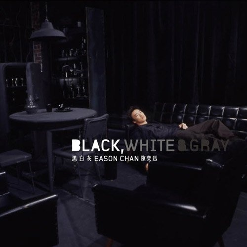

	

# [黑白灰](https://music.163.com/album?id=6548)

* 时间：2003-04-01
* 歌手：陈奕迅
* 唱片公司：英皇娱乐
## Songs

* [阿怪](songs/阿怪_66838/README.md)
* [我们都寂寞](songs/我们都寂寞_66840/README.md)
* [兄妹](songs/兄妹_66841/README.md)
* [十年](songs/十年_66842/README.md)
* [要你的](songs/要你的_66844/README.md)
* [世界](songs/世界_66846/README.md)
* [谢谢](songs/谢谢_66849/README.md)
* [像一句广告](songs/像一句广告_66852/README.md)
* [寂寞奏鸣曲](songs/寂寞奏鸣曲_66855/README.md)
* [Last Order](songs/last_order_66858/README.md)
## Appendix

### Description

⊙陈奕迅2003年国语专辑black.white＆gray 黑 白 灰
概念...
黑 白 灰 不存在于彩虹里的颜色
却存在于生活的遭遇中
生活中
黑或白
正或邪
胜或败
不是绝对
其实在现实里
大部分的人都身处于黑与白中间的灰色地带而不自觉
专辑...
用音乐反映出 黑 白 灰
对生活的诠释
eason首次在国语专辑中出现以“概念”（concept）方式融合音乐的专辑
整张专辑由三位制作人共同组成分别为：
旧识
Jim Lee
共制作专辑六首歌曲
分别为：阿怪、我们都寂寞、兄妹、要你的、像一句广告、寂寞奏鸣曲
由于Jim与eason同样拥有西方教育的成长背景
以及多年来合作所培养的默契
因此歌手与制作人之间有着相当契合而神奇的化学作用
理所当然在此次制作方面同样邀请到Jim担任制作部分
资深制作人并已有近十年没有为专辑担任制作人的陈小霞
共制作专辑三首歌曲
分别为：十年、世界、谢谢
陈小霞对eason的歌声
其乐理念与执着态度的欣赏
以及eason亲自向陈小霞的诚挚邀请
成为陈小霞会在相隔多年之后再度因为eason进入录音室担任制作人的原因
eason“心仪”许久的合作对象终于在黑.白.灰专辑结缘
香港拥有优秀口碑的顶尖音乐人eric kwok
制作专辑一首歌曲
last order
eric与eason同样是属于拥有绝佳合作默契的音乐旧识
曾经在eason的广东专辑之中创造出许多叫好又叫座的作品
令人印象深刻与知名的的一首便是“幸福摩天伦”
不管是何种类型的歌曲eric总是将歌曲的舒适与耐听程度推向最高境界

### Score

|歌曲数|评论数|分享数|
|:---:|:---:|:---:|
|10|181|85|

|歌名|分数|
|:---:|:---:|
|十年|95.0
|兄妹|65.0
|谢谢|50.0
|世界|30.0
|Last Order|30.0
|阿怪|25.0
|我们都寂寞|25.0
|寂寞奏鸣曲|25.0
|像一句广告|20.0
|要你的|5.0
