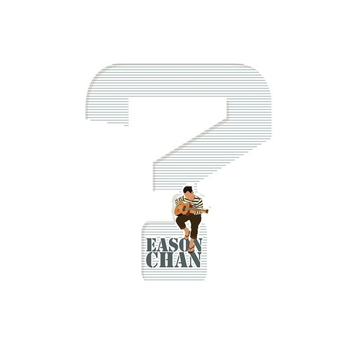

	

# [？](https://music.163.com/album?id=6341)

* 时间：2011-11-11
* 歌手：陈奕迅
* 唱片公司：环球唱片
## Songs

* [孤独患者](songs/孤独患者_64093/README.md)
* [哎呀咿呀](songs/哎呀咿呀_64097/README.md)
* [看穿](songs/看穿_64101/README.md)
* [吟游诗人](songs/吟游诗人_64106/README.md)
* [张氏情歌](songs/张氏情歌_64111/README.md)
* [Baby Song](songs/baby_song_64116/README.md)
* [听一千遍后](songs/听一千遍后_64121/README.md)
* [内疚](songs/内疚_64126/README.md)
* [还要不要走](songs/还要不要走_64131/README.md)
* [积木](songs/积木_64136/README.md)
* [神奇化妆师](songs/神奇化妆师_64141/README.md)
* [Muffin Man](songs/muffin_man_64146/README.md)
* [那些让你死去活来的女孩](songs/那些让你死去活来的女孩_5418001/README.md)
## Appendix

### Description

人生历练越多，脑里问号亦增多。面对百般人性的问题，你会作出怎样的答案？陈奕迅2011国语专辑【 ？】，代入不同的角色，游走说唱人生不同面。首支派台歌《张氏情歌》的声嘶力竭情感泛滥；到第二派台作品《神奇化妆师》以微妙的比喻，唱出每个人都会埋藏人性令人难分心意的真伪。大碟抱着充满疑问的角度分析诸君面孔，令你我从新探讨人性，研究各色情绪。
此张国语专辑，找来华语乐坛顶尖音乐人合作，包括方大同、蓝又时、陈奂仁、陈小霞、叶广权等制作。10首国语曲、加上2首广东歌及1首英文歌，交织成令人回味的陈奕迅2011国语专辑【 ？】，等待你倾听人性的故事，答案如何？让陈奕迅带你一起开发。

### Score

|歌曲数|评论数|分享数|
|:---:|:---:|:---:|
|13|384|548|

|歌名|分数|
|:---:|:---:|
|孤独患者|100.0
|吟游诗人|100.0
|Baby Song|100.0
|内疚|100.0
|积木|100.0
|看穿|95.0
|张氏情歌|95.0
|Muffin Man|95.0
|神奇化妆师|90.0
|那些让你死去活来的女孩|90.0
|哎呀咿呀|85.0
|还要不要走|80.0
|听一千遍后|75.0
