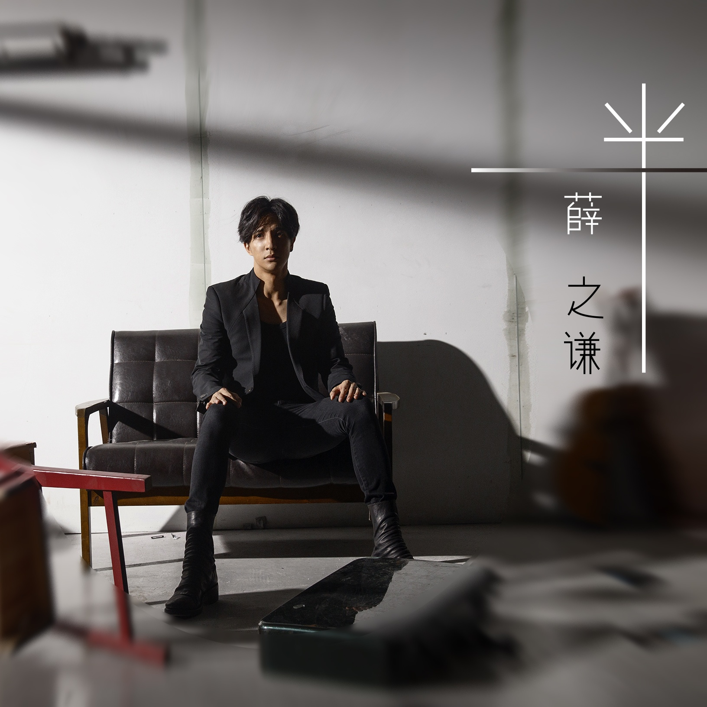

	

# [一半](https://music.163.com/album?id=3316028)

* 时间：2015-10-19
* 歌手：薛之谦
* 唱片公司：海蝶音乐
## Songs

* [一半](songs/一半_35528482/README.md)
* [小孩](songs/小孩_35288183/README.md)
* [Stay Here](songs/stay_here_35528483/README.md)
## Appendix

### Description

2015 1/2的薛之谦 EP 《一半》

纪念我倔强的性格 已逝的爱情

一半的我，不完整，

一半的人生，差一半。

一半的我用心的唱故事给你听，

一半的你是否能够感知到？

《一半》的我很逞强，一半的我是个《小孩》，只希望你《stay here》，不要离开。

2015年正式签约海蝶音乐的薛之谦，比起以往多了一个制作人的身份，也就有了更多参与自己音乐制作的空间。此张EP取名《一半》，也是2015年度薛之谦出的第二张EP大碟。这张EP同上一张一样，也由薛之谦亲自担任制作人，做起自己的音乐来也就格外用心。这张EP里收录了他精心演绎的三首新歌：《一半》、《stay here》和《小孩》。

成年的世界里，爱有时候没有绝对的完整。爱一半，伤一半，再骄傲的人，也有说不出的话语和隐痛的伤口。或许能像孩童那般纯粹地去爱，便不再会有如此复杂的心绪。这三首歌，不是普通的感怀伤秋，也不是为了写歌而写歌所诞生的EP，历经时间的洗礼，薛之谦终于将过去的情感伤痛放下，也终于能够将它们呈现在歌里。纯粹、悲伤、决绝、挣扎、怀念、遗憾……他唱出了男人的爱，男人的痛，以及男人内心深处温情的柔软角落。

薛之谦在这张EP中担任了两首歌的词，一直对音乐认真到有点“处女座”的他，此次也同样怀着十二分的专注。不光是选到了自己中意的曲，他反复琢磨、通宵达旦写出的《一半》和《stay here》，也在里面注入了自己的真实感触；而当听到郭顶词曲的《小孩》，更是觉得符合了自己的心境。有时候男人就像一个小孩，一个长不大的小孩。

于是，真实的故事用真情唱，当你听到谦谦的情歌，也不由心中一痛。时而忍不住去猜，究竟是怎样，造就了如今的薛之谦。这个倔强的男人，用自己逝去的真实情感经历，惹掉了无数人的眼泪。

### Score

|歌曲数|评论数|分享数|
|:---:|:---:|:---:|
|3|801|462|

|歌名|分数|
|:---:|:---:|
|一半|100.0
|小孩|100.0
|Stay Here|95.0
