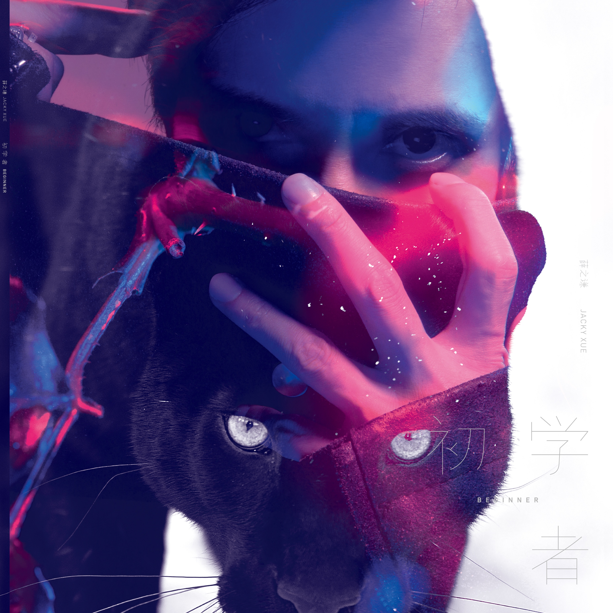

	

# [初学者](https://music.163.com/album?id=34780271)

* 时间：2016-07-18
* 歌手：薛之谦
* 唱片公司：海蝶
## Songs

* [初学者](songs/初学者_412902689/README.md)
* [刚刚好](songs/刚刚好_415792881/README.md)
* [我好像在哪见过你](songs/我好像在哪见过你_417859631/README.md)
* [演员](songs/演员_421160836/README.md)
* [绅士](songs/绅士_421148953/README.md)
* [一半](songs/一半_421160837/README.md)
* [小孩](songs/小孩_421148954/README.md)
* [Stay Here](songs/stay_here_421148955/README.md)
* [花儿和少年](songs/花儿和少年_421160838/README.md)
* [下雨了](songs/下雨了_421148956/README.md)
## Appendix

### Description

2016年华语乐坛杀出重围冠军作

薛之谦 《初学者》

重拾初心 勇往直前

在梦想丛林抱持初生之勇

做变幻世界最后的初学者

7/17 正式发行

亚洲最火的段子手薛之谦 不忘初心强势回归乐坛

薛之谦、郑伟、赵英俊、李荣浩、郭顶等等王牌音乐人联手制作

2016年华语乐坛杀出重围冠军作－《初学者》

从选秀节目初试啼声到正式加入演艺圈并成功以多首脍炙人口的畅销歌占据歌坛地位，“薛之谦”这个名字代表着一股朝气蓬勃的勇气。过了几年由于经纪公司经营上的动荡与变化，以致于在音乐路上历经多番波折，薛之谦一度面临漫长且煎熬的人生低潮期。虽然演艺之路遇到挫折，但薛之谦一转念，又以初生之犊的姿态勇敢创业，进攻饮食与潮流产业却一举创下佳绩。在副业上大放异彩之际，薛之谦仍不忘初衷，潜心创作与做音乐。多亏他始终抱持着对音乐的无限狂热，于是我们听到了《绅士》、《演员》、《丑八怪》、《小孩》、《一半》……等等音乐形态丰富多变且质量优秀的好歌。幽默风趣怪点子特别多的薛之谦近年更以“段子手”形象席卷综艺圈以及网路世界，今年手上少说至少有十个节目的固定班底邀约，薛之谦的知名度一飞冲天，立即成为亚洲最火的综艺奇才！成功背后的原因在于他始终把自己当做人生的初学者，不管对歌唱、演戏、搞笑、经商每个领域上永远谦卑学习，虚心吸收，努力耕耘，一步一脚印擦亮“薛之谦”这个金字招牌！ 新专辑《初学者》除了收录近期在乐坛掀起热烈回响的四首新作－《初学者》、《刚刚好》、《我好像在哪见过你》、《花儿和少年》之外，也一举收录了多首薛之谦最耳熟能详的代表作如《演员》、《绅士》、《一半》、《小孩》、《Stay here》和《下雨了》。一举收录了多位才华横溢的音乐人如薛之谦、郑伟、赵英俊、李荣浩、郭顶的精心制作的优质音乐。希望乐迷们可以感受到薛之谦推出实体唱片的心意。

在人生的道路上自愿当永远的初学者

2016年薛之谦首支硬派摇滚之作－《初学者》

2016年 夏天，薛之谦暂时卸下搞笑的面具，回归初心，即将以音乐人的身份再次征战歌坛。薛之谦2016年第一首曝光作品《初学者》即将为他生命全新的乐章揭开序幕！《初学者》这首歌作为薛之谦回归乐坛的野心之作，在音乐形态上以前所未有的硬派摇滚强势登场。《初学者》这首歌的词曲皆由薛之谦一手包办。前奏，以充满悬疑片的神秘氛围开场，从主歌开始缓缓流泻的音符一直到中间高潮之处的音效处理中，薛之谦突发奇想加入了犹如古老圣歌般奇瑰的女高音，让整首歌进入更具深度的层次。薛之谦在音色的诠释上揉合了更多夸张的戏剧元素，配合歌词中充满无边想象力的绮丽意象，再次证明他在音乐上的过人才情与驾驭歌唱的雄浑实力！编曲中硬派的摇滚风充满了征战与挑衅的意味，让人听得热血淋漓，大呼过瘾！《初学者》的歌词阐述的是在感情里很多人都曾经当过懵懵懂的初学者，只凭着单纯的念头对一个人傻傻地付出。人们在爱情的路上越挫越勇，越学越多，到最后每个人身上都挂满华丽的伤口，却回过头来高傲地，开始嘲笑着对自己崇拜的初学者。《初学者》的歌词充满炫目丰富的视觉映象，字里行间彷佛可以清晰勾勒出爱情里弱肉强食，胜者为王的残酷画面。但是回顾薛之谦过去的人生轨迹，也多亏了他这股初生之犊不畏虎的勇气，每每把触角伸展到新的人生版图之时，他都大胆让自己归零，永远把自己当初学者一般勇于挑战，反而一次又一次迎来胜利的徽章！也许在爱情的世界里，最没有经验的初学者可能才是最无敌的也说不定！2016年的夏天，竖起你的耳朵，让全中国重新认识“音乐人薛之谦”！

“我们的爱情到这刚刚好 剩不多也不少 还能忘掉”

卸下段子手的华丽戏服 薛之谦诚恳唱出分手恋人的勇敢与不舍

2016年薛之谦《初学者》专辑伤情推荐第一抒情主打《刚刚好》

继《初学者》在视觉与听觉上给予乐迷强烈震撼之后，薛之谦紧接推出新专辑《初学者》的第二首曝光单曲－《刚刚好》。《刚刚好》这首歌同样由薛之谦词曲操刀，乃他最擅长以深情慢歌便能“杀人不见血”的抒情之作。薛之谦诠释的经典情歌诸如《丑八怪》、《绅士》、《演员》……等等歌曲至今仍曲犹在耳，传唱度持续延烧。这次推出新专辑，除了极力创作全新音乐品种之外，薛之谦仍不忘回馈一路支持他的乐迷最熟悉的“薛情歌”。近年薛之谦以诙谐搞笑形象红遍综艺圈，但一直有死忠歌迷引颈企盼，并不停询问薛之谦什么时候要再唱情歌？《刚刚好》这首歌便顺应而生。《刚刚好》这首歌的旋律层次分明，尤其副歌听来记忆点高，只听过一次便能让你跟着哼唱。编排细腻的和弦走法加上薛之谦的诚垦音色彷佛他此刻已卸下段子手的华丽戏服，还原成一个男人面临分手时候的勇敢与不舍，让人听了心生感动。薛之谦的写词功力经由这些年的创作淬炼更是一举升华，字字要命，句句正中要害！“如果分手太复杂 流浪的歌手会放下吉他”、“我们的流浪到这刚刚好 趁我们还没到天涯海角 我也不是非要去那座城堡”、“是否要逼人弃了甲 亮出一条伤疤 不堪的根源在哪”……每句歌词都直捣恋人的内心世界，说出了一个男人为了让深爱的人宽心，宁愿自己开口提分手，把爱情亲手结束在“刚刚好”的时机，却背对着恋人强忍泪水。有类似分手经验的人想必会对《刚刚好》这首歌产生共鸣！重新披上“情歌手”外衣的薛之谦，这次会让你对他的内敛伤情深深触动！

“人们把难言的爱都埋入土壤里 袖手旁观着别人尽力撇清自己”

耽溺于让人浮想连翩的情感暗涌 薛之谦展现成熟男人的内心风景

2016年薛之谦《初学者》专辑隐情推荐第二抒情主打《我好像在哪见过你》

继在市场上叫好叫座的《初学者》与《刚刚好》的曝光以后，薛之谦的全才创作歌手形象再度刷新大家对他的印象。尤其《刚刚好》这首标淮的“薛情歌”让广大乐迷们再度跌入薛之谦的抒情魅力中，纷纷在敲碗询问还有没有下一首情歌可以一解情歌之渴。这首再次由薛之谦词曲创作的《我好像在哪见过你》即将让大家重新认识情歌的薛之谦。《我好像在哪见过你》有别于《刚刚好》的深情婉约，所带来的情感浓度是更加浓稠的，歌词的遣词用句也更加趋于意识形态的展现。这首歌的听觉氛围就像一个人在深夜眺望一片深蓝色的海洋，视野尽头表面上看似风平浪静，但实则海平面下却暗潮汹涌，蕴藏着情感的漩涡。歌曲的音符缓缓揭开一段尘封的爱情故事的序幕，让人看见更趋广角的成熟男人的内心风景。这首歌的歌词想说的是“在爱的人的面前压抑住内心漫溢的情感”的柏拉图式爱情。碍于现实的限制，两个有过故事的人，在往后的人生再度相会了，可是却无法再续前缘，只好把澎湃的爱深埋在心里，把对方当陌生人一样看待。就像歌词里提起的“人们把难言的爱都埋入土壤里 袖手旁观着别人尽力撇清自己”、“我听见了你的声音 也藏着颗不敢见的心”、“你听不到我的声音 怕脱口而出是你姓名”一样，这种复杂却让人浮想连翩的爱情故事，是经历过时间洗礼的成熟男人才会体悟到的悲哀。薛之谦的这首《我好像在哪见过你》会让你听见更具深度与想象力的薛情歌！

《初学者》专辑与新视觉团队首次合作 发掘出有别以往的潜在魅力

薛之谦以摇滚硬汉与温柔绅士两种形象呈现双面风格

专辑封面以黑豹隐喻薛之谦对音乐的野心永远具有勇往直前的勇气

为了打造新专辑《初学者》的全新风格，薛之谦在专辑配唱与节目录影的百忙之中再次踏入台湾，与台湾的顶尖视觉团队合作拍摄专辑照。除了掌镜的摄影师黄中平导演是已合作多次的伙伴，从造型师、化妆师、发型师甚至专辑的美术设计都是第一次合作的协力人员。薛之谦完全把自己当作“初学者”交由新的合作团队打造全新形象。薛之谦笑说：“我跟经纪人与企划人员说请各位老师们尽管乱搞我，哈哈，我想让专业的团队大胆地在我身上创造新的东西！”

薛之谦抵台的第一天一下飞机就赶到拍摄现场执行服装造型的定装与开始进行梳化。再次来到台湾与黄中平导演拍摄专辑视觉，薛之谦对于黄导的用心和细心与对美学的坚持依然感到钦佩。黄导在拍摄专辑照片的时候特别请灯光组设计了色光的表现，以求拍出薛之谦有别以往的风格。专辑造型由造型师与薛之谦本人共同搭配出两套造型。第一套为代表着《初学者》的摇滚曲风的“摇滚硬汉”形象，第二套则代表着专辑内抒情情歌例如《刚刚好》的“温柔绅士”形象。拍摄过程非常顺利，薛之谦的专业表现让黄导不断称赞他不愧为“资深艺人”，对于如何展现自身魅力非常上手。其中一组视觉的呈现手法是黄导希望有两个薛之谦互相决斗的感觉。一个为初学者的他，一个为身经百战、经验值丰富的他。手法是透过美术的后期去把胜利与落败的薛之谦合成在同一组画面。于是在拍摄的时候，薛之谦必须运用想象力去诠释两种动作、两种情绪的他。然而薛之谦在拍照时候表演之精准让现场工作人员为之折服！

《初学者》这张专辑内的封面与视觉呈现出的双面风格呼应了专辑所收录的多首曲目的多面性。即有摇滚的快歌，也包涵了抒情的慢歌。专辑视觉内五彩缤纷的色彩也巧妙地与薛之谦在演艺圈全方位涉足的形象不谋而合。不论从唱歌、演戏、主持到写段子，薛之谦将继续在演艺圈散发属于自己的缤纷色泽。尤其平面设计师在专辑的美学编排上特别加入了许多野生动物的概念，例如黑豹代表了薛之谦在做音乐的路上抱持着雄心勃勃、勇往直前、不怕输的勇气；蚂蚁则隐喻了爱情甜美的诱惑。别具巧思的美学风格增加了收藏价值，也同时给予薛之谦的音乐另外一种艺术诠释。

与金曲奖最佳音乐录影带奖得主黄中平导演携手合作拍摄《初学者》MV

薛之谦误闯神秘旅馆迎战鹰、猫、豹三殊  大尺度与妙龄少女上演亲热戏

拍完专辑照片的隔天薛之谦马上马不停蹄展开了《初学者》MV的拍摄工作。此次再度与金曲奖最佳音乐录影带奖得主黄中平导演合作拍MV，薛之谦与黄导的默契更上一层楼。早在初期在讨论《初学者》的MV脚本的时候，两方的构思都不约而同出奇契合。黄导在研读《初学者》这首歌的歌词的时候便觉得歌词予人广阔的想象空间，随着气势诡谲的编曲犹如踏入一场奇幻之旅。于是黄导把脚本设定为薛之谦扮演一个误闯奇幻神秘旅馆的贵族住客，在旅馆中邂逅了三个分别象征“鹰”、“猫”、“豹”的女住客。如果以这三种动物比拟为爱情世界的兽性而言，豹与鹰代表在食物链顶端最具有杀伤力的狠角色，猫相对来说为最少攻击力的“初学者”。薛之谦在第一与第二间房间分别与“鹰女”及“豹女”展开心惊胆战的爱情战术。虽然过程紧张刺激，但与他交锋的“恶”至少是台面上的明目张胆。然而邂逅清纯可人的爱情初学者－“猫女”之后，薛之谦扮演的住客一时掉以轻心不慎跌入了“猫女”的“天真陷阱”，还因而差点丧命！薛之谦对这个脚本非常喜欢。他表示《初学者》的歌词里面暗喻的就是这种“爱情食物链”！每个在爱情里面历经风霜、伤痕累累的“爱情老手”几乎都是从“初学者”演练而来的。当初身为爱情初学者时候的那股初生之犊的勇气往往充满最原始的爆发力，就如同MV里的“猫女”一样，最后一刻反而反败为胜，将了爱情老手一军！

为了凸显《初学者》澎湃曲风的戏剧张力，黄导特别安排了薛之谦与饰演“猫女”的妙龄混血女演员来一场让人面红耳赤的激情床戏。对于在MV里演出激烈亲热戏，薛之谦私下不断询问导演：“女演员的妈妈她有同意吗？”薛之谦的幽默几乎把片场每个人都逗乐了。但轮到他正式上场之时，薛之谦拿出了专业演员的素养，很成功便把亲热戏顺利演完。虽然中间偶有笑场，但是画面呈现出来近乎真枪实弹的性感氛围让现场女性工作人员都脸红了！黄导更宣称这个性感尺度在他过往拍摄过的MV里面已经是排行前几名的大胆了！《初学者》MV耗资百万台币打造的实景奇幻旅馆的美术质感以及兽女们的特殊化妆与造型足以媲美电影的规格！希望透过视觉团队的用心，《初学者》这首MV的想象力可以如同歌曲本身一样予人鸡皮疙瘩的艺术效果！

与台湾乐坛新晋宅男女神林明祯演出第二波伤情主打《刚刚好》MV

薛之谦发挥段子手诙谐才能 戏里深情动人 戏外欢笑连连引人发噱

薛之谦《初学者》专辑的第二波伤情主打歌《刚刚好》邀请了目前台湾乐坛新掘起的新女神林明祯演出MV女主角。MV脚本撰写了薛之谦扮演的爱情诊疗师与林明祯扮演的失恋女孩的一段感伤的爱情故事。女生在一次感情的重创中失去记忆，在男生的细心照料与“诊疗”之下，女生渐渐恢复记忆，才猛然发现眼前这位陪伴自己疗伤的男子就是当时自己背叛过的恋人。男生最后选择在“刚刚好”的时分跟女生提分手，成全她并希望她走向她更爱的人的方向去。导演想出来的脚本唯美感人，可是一到段子手薛之谦手上，却马上一秒变喜剧！

《刚刚好》的MV拍摄日的第一场戏大队就到台湾新北市贡寮区的知名景点三貂角灯塔去取景。可以藉由拍摄行程来到观光点对薛之谦来说是工作伤的意外收获。初见女主角不到两分钟便要马上演出与女主角在回忆中的拥抱戏，一时之间两位演员还有点尴尬。结果才拍了几场戏，女主角与全场工作人员就被不停耍宝的薛之谦逗得哈哈大笑了。尤其导演找来一台价值不菲的悍马当作爱情诊疗师的“诊疗车”便让薛之谦觉得不可思议和感到有趣。在导演解释这部MV里的所有医疗相关的对象都是采用意识形态的方式呈现时，薛之谦又马上投入剧情角色化身深情款款的爱情诊疗师了。拍完眺望灯塔的戏份之后，大队又移动到海边的旧式车站拍摄分手的戏。拍摄时间适逢中午人流和车潮繁忙时刻，围观的民众包括游览车上的观光客一眼就认出男女主角，纷纷争相要来拍照，让薛之谦谦虚地反问工作人员：原来我在台湾也这么红？《刚刚好》MV的最后一场戏则到西门钉的一个时尚餐厅进行拍摄。导演与美术团队把餐厅的角落改装成后现代风格的“爱情诊疗所”。在这个场所中林明祯所饰演的失恋女孩被爱情护理师们轮流治疗。不知道是不是一整天的工作累积下来的体力符合，薛之谦彷佛“回光返照”般越夜越有精神。每每拍到需要跟女主角深情对望的戏份他就在镜头外拼命耍宝，逗得女主角忍俊不尽！

《刚刚好》MV一直拍到深夜时分才收工。过程虽然辛苦但成品出来以后大家都非常满意。薛之谦也对黄中平导演在掌握抒情歌氛围的扎实功力赞不绝口！薛之谦与林明祯的精彩对手戏也大大地帮《刚刚好》这首歌起了美好的化学作用！

《初学者》专辑收录曲目

1.初学者

2.刚刚好

3.我好像在哪见过你

4.演员

5.绅士

6.一半

7.小孩

8.Stay here

9.花儿和少年

10.下雨了

### Score

|歌曲数|评论数|分享数|
|:---:|:---:|:---:|
|10|9349|4690|

|歌名|分数|
|:---:|:---:|
|初学者|100.0
|刚刚好|100.0
|我好像在哪见过你|100.0
|演员|100.0
|绅士|100.0
|一半|100.0
|Stay Here|100.0
|花儿和少年|100.0
|下雨了|100.0
|小孩|95.0
