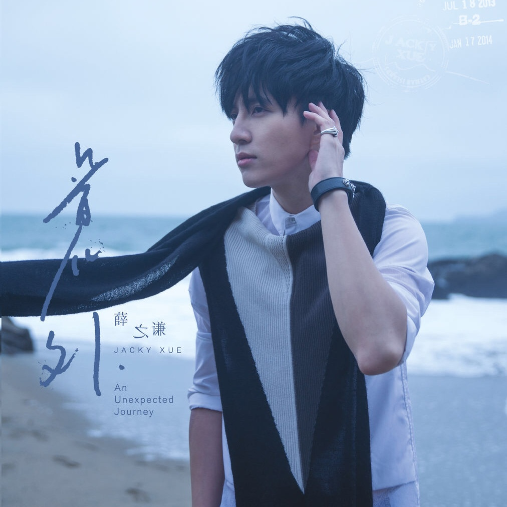

	

# [意外](https://music.163.com/album?id=2681139)

* 时间：2013-11-11
* 歌手：薛之谦
* 唱片公司：海蝶音乐
## Songs

* [丑八怪](songs/丑八怪_27808044/README.md)
* [意外](songs/意外_27890306/README.md)
* [你还要我怎样](songs/你还要我怎样_27955653/README.md)
* [有没有](songs/有没有_27955656/README.md)
* [潮流季](songs/潮流季_27955651/README.md)
* [等我回家](songs/等我回家_27955652/README.md)
* [我想起你了](songs/我想起你了_27955655/README.md)
* [其实](songs/其实_27955654/README.md)
* [方圆几里](songs/方圆几里_27955658/README.md)
* [方圆几里 (吉他版)](songs/方圆几里_吉他版__27955657/README.md)
## Appendix

### Description

人生本就是一场意外，纵横交错的际遇遍布着生活的每个角落。

每天都在遇见不同的人，经历不同的风景，行走不同的轨迹。

面对未知的生活，我们一直都在寻寻觅觅中快步疾行，很多人擦身而过，很多事过眼烟云。抓不住，放不下，在患得患失中我们不停地迷失、遗忘、错过。

你惧怕意外吗？还是害怕无法预料的将来？

我们常常否定现状，假设未来。但生活依旧不断前行。

遇见你是一场意外，但是如果没有遇见你，我又将去往何方？

一个人去静静流浪，亦或颠覆过往，来一回彻底的刺激疯狂。

沿途风景匆匆倒退，当一切终归尘埃落定，

你是否还会站在原处，陪我一起看那最初的风景。

一本书上曾说：旅行，能让你遇见那个更好的自己。

对于正式步入而立之年的薛之谦来说，“人气偶像”、“内地乐坛音乐才子”、“乐坛情歌王子”以及“薛老板”的种种头衔，是外界的口碑肯定也是薛之谦本人不断努力的成果。

其实，一直以来，薛之谦都在暗自寻求着改变。

薛之谦不是只会唱歌，于是他在演唱会上跳起了劲舞。

薛之谦不是只会当艺人，于是他下海经商还大获成功。

但是，音乐始终，是他的一生执着。于是这次，他想要改变更多，发自内心的，一次重新自省，一种重新认识。

依旧是娓娓道来的“薛氏情歌”，依旧是深情执着的音乐才子

但更豁达，更成熟，更态度，一个完完全全的更好的薛之谦。

### Score

|歌曲数|评论数|分享数|
|:---:|:---:|:---:|
|10|2108|1857|

|歌名|分数|
|:---:|:---:|
|丑八怪|100.0
|意外|100.0
|你还要我怎样|100.0
|有没有|100.0
|潮流季|100.0
|等我回家|100.0
|我想起你了|100.0
|其实|100.0
|方圆几里|100.0
|方圆几里 (吉他版)|100.0
