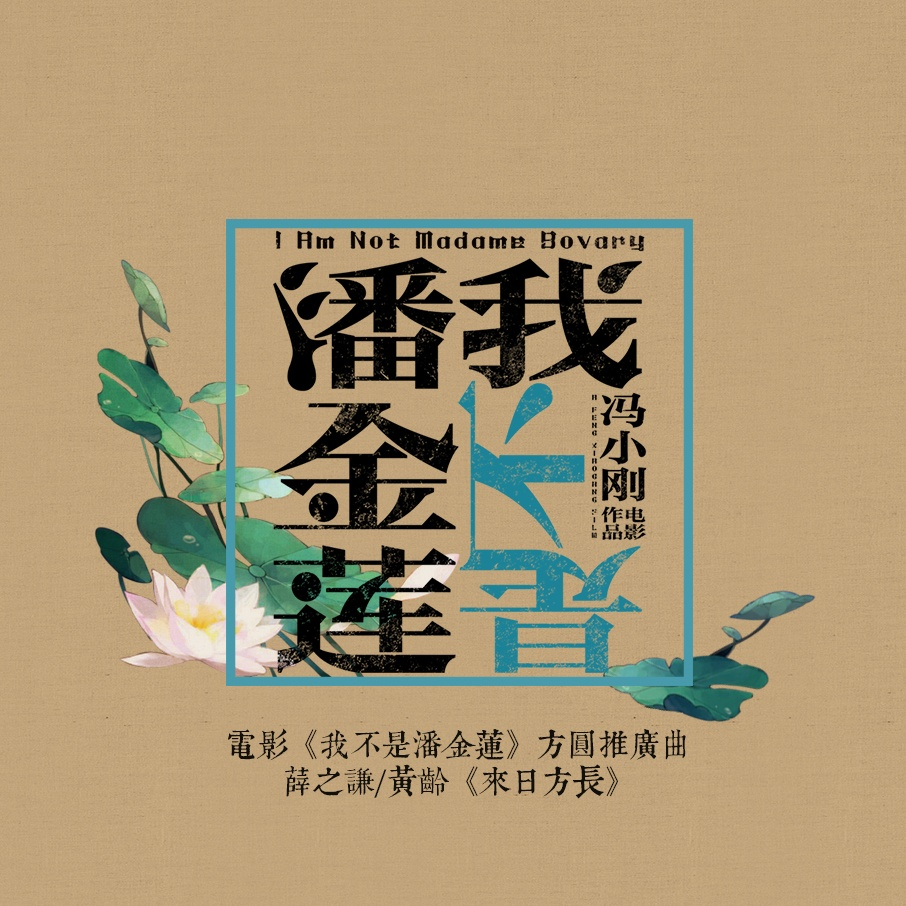

	

# [来日方长](https://music.163.com/album?id=34861909)

* 时间：2016-09-12
* 歌手：薛之谦，黄龄
* 唱片公司：源丰泰坤
## Songs

* [来日方长](songs/来日方长_429450375/README.md)
## Appendix

### Description

薛之谦黄龄携手献唱冯导新作  《我不是潘金莲》推广曲全网上线

冯导新作《我不是潘金莲》推广曲首发  薛之谦黄龄默契演绎《来日方长》

近日，由女神范冰冰领衔主演，郭涛、大鹏、张嘉译、于和伟、张译、李宗翰、赵立新、范伟、刘桦等“大叔级”实力派演员倾情加盟，根据刘震云同名小说改编，由著名导演冯小刚执导的喜剧电影《我不是潘金莲》即将上映，影片方圆版推广曲《来日方长》也于今日全网上线。

超人气“段子手”薛之谦携手实力唱将“转音歌姬”黄龄亲情演绎。歌曲由著名音乐人常石磊担任制作人并领衔创作，而薛之谦黄龄这对“老搭档”的深情与默契也在歌曲中展露无遗，细腻而温暖，轻呢而悠然，弥漫着缓缓时光的醇静味道。

关于《来日方长》

薛之谦与黄龄对唱的这首《来日方长》，不仅是电影《我不是潘金莲》的推广曲，还是黄龄即将陆续推出的2016年全新专辑《来日方长》的同名主打歌。此前，薛之谦也是因为范冰冰的一条微博而与电影《我不是潘金莲》结缘，毛遂自荐的他成功加盟这首推广曲《来日方长》，与黄龄深情演绎，更与制作人常石磊再次深度合作，可见其诚意十足。

据悉，该歌曲的MV也将于2016年9月14日与公众见面。黄龄全新专辑除首波同名主打《来日方长》外，其余新作将会陆续与大家见面。该歌曲由黄龄工作室携手中国唱片倾情打造，中国唱片荣誉出品，奔跑怪物与百慕文化联合全网发行强势推荐。

关于《我不是潘金莲》

由冯小刚导演执导的喜剧电影《我不是潘金莲》，讲述的是李雪莲的前夫骂李雪莲是“潘金莲”，为了还自己一个清白，李雪莲开始状告他。但一件事很快变成了另一件事，为了纠正一句话，李雪莲告了二十年的故事。从片方曝光的几组先导预告中，观众可以强烈感受到冯小刚新作现实主义风格与幽默元素。该片将于2016年9月30日全国上映。

### Score

|歌曲数|评论数|分享数|
|:---:|:---:|:---:|
|1|1749|520|

|歌名|分数|
|:---:|:---:|
|来日方长|100.0
