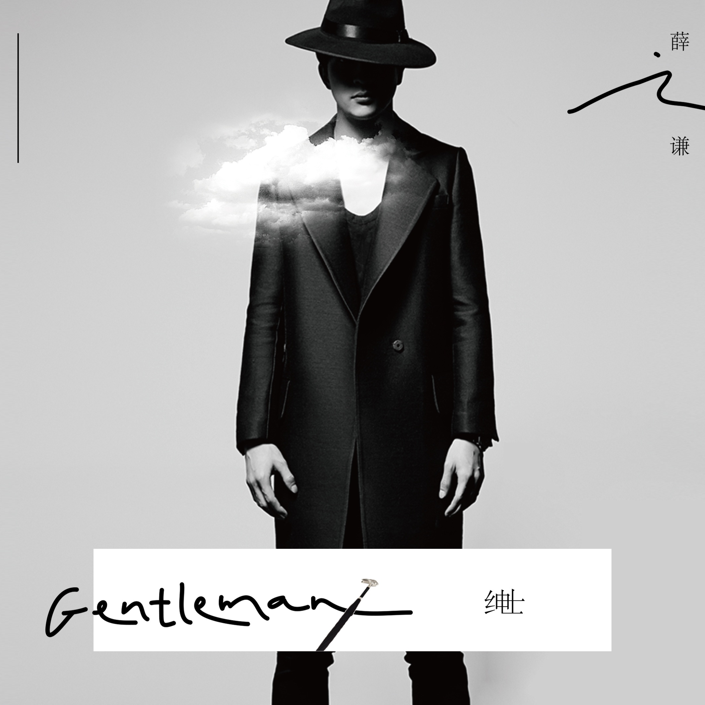

	

# [绅士](https://music.163.com/album?id=3154175)

* 时间：2015-06-05
* 歌手：薛之谦
* 唱片公司：海蝶音乐
## Songs

* [演员](songs/演员_32507038/README.md)
* [绅士](songs/绅士_32192436/README.md)
* [下雨了](songs/下雨了_32507039/README.md)
## Appendix

### Description

当那背影离去 仿佛也可以 脱下礼帽 深情致敬

全唱作把『心』交出来

最认真的

薛之谦

再次穿越感官最后防线突破抑制 尽情泪流

2015全唱作 NO.7概念EP『绅士』6/5 海蝶音乐诚意发行

从带上面具的《丑八怪》到摘下礼帽的《绅士》

这，都是薛之谦

这，都是用优雅到极限来诠释伤悲的爱情寓言

3首全唱作谦谦情歌

令每一个爱过的人都痛到慰藉 让每一个爱着的人也为之黯然

出道10年，2015年正式签约海蝶音乐，首次担当制作人的薛之谦，包揽了这张概念EP的所有词曲，仅3首唱作曲目，但是100%的薛之谦。从上一张专辑到《绅士》经历了19个月，往返北京、上海、台北……好好做“音乐”是薛之谦最认真的梦想，不遗余力，甚至有些强迫症。

从《认真的雪》到《你还要我怎样》，薛之谦的情歌，听着总是让人不由的纠结和悲伤。“相对于作曲，我更加喜欢填词。”这一次作为EP总制作人的他，是这样评价自己的。

“在爱情面前，我不是一位《演员》，但愿成为一名《绅士》。”

翻开歌词本，带上耳机，听完这三首歌，你会发现，这里住着一位“心里下着雨”的薛之谦。

### Score

|歌曲数|评论数|分享数|
|:---:|:---:|:---:|
|3|1508|1271|

|歌名|分数|
|:---:|:---:|
|演员|100.0
|绅士|100.0
|下雨了|100.0
